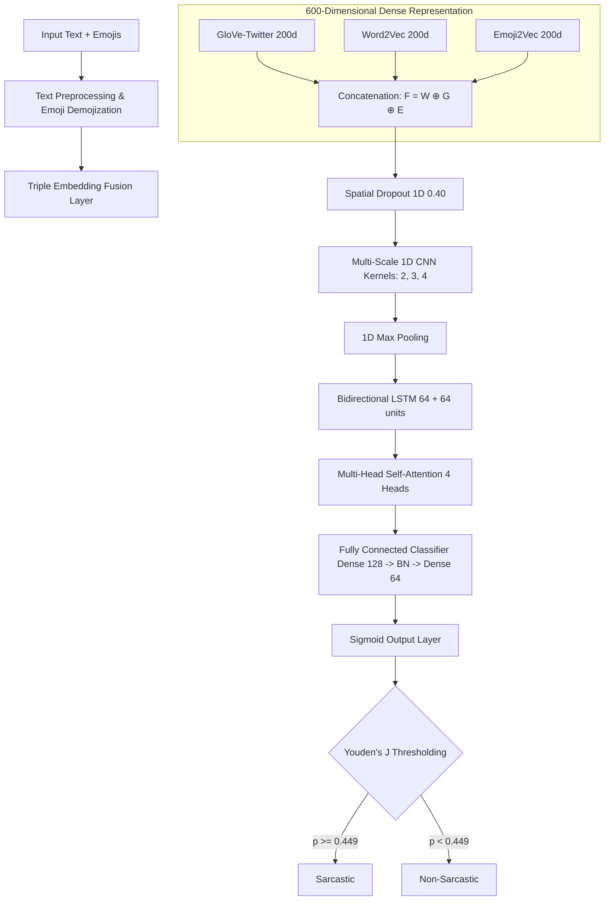

# 🎭 Sarcoji-SentiFusion

[](https://huggingface.co/spaces/Athxrv/Sarcoji-SentiFusion_app)
[](https://github.com/atharv-0705/emoji-aware-sarcasm-detection)
[](https://fastapi.tiangolo.com)
[](https://streamlit.io)
[](https://www.python.org/)
[](https://tensorflow.org)
[](https://opensource.org/licenses/MIT)

> **A Hybrid NLP & Deep Learning Framework for Emoji-Aware Sarcasm Detection, Sentiment Analysis, Emotion Recognition, and Cyberbullying Identification.**

---

## 📌 Overview

**Sarcoji-SentiFusion** is an end-to-end, high-performance customer feedback analytics platform designed to solve one of the most challenging bottlenecks in natural language processing (NLP): **sarcasm and context-dependent sentiment analysis in user-generated text.**

### Why Sarcasm and Emojis Matter
In modern digital communication, traditional sentiment classifiers frequently fail. A statement like *"I love waiting 3 hours for customer support! 🙄"* contains highly positive lexical tokens ("love", "support") but carries a completely negative sentiment. 
* **Sarcasm** flips polarity, causing standard rule-based or simple ML systems to generate false positives.
* **Emojis** serve as critical emotional proxies, providing the missing visual cues that humans use to decipher tone. Emojis can act as sarcasm amplifiers (e.g., `🙄`, `😂`, `👏`) or sentiment stabilizers (e.g., `😊`, `❤️`).
* **SentiFusion** addresses this by leveraging a **Triple Embedding Fusion** layer (GloVe + Word2Vec + Emoji2Vec) combined with a robust **CNN-BiLSTM-Attention** neural architecture, capturing both fine-grained local semantics and long-range contextual ironies.

---

## ✨ Key Features

*   **🎭 Sarcasm Detection**: Predicts sarcasm using Youden's $J$ optimized classification thresholds.
*   **💬 Sentiment Analysis**: Employs hybrid modeling to capture both deep neural sentiment trends and lexicon-based baseline polarity (via VADER).
*   **😊 Emoji Semantic Analysis**: Extracts, demojizes, and interprets emojis using specialized high-dimensional `Emoji2Vec` embeddings to determine their semantic weight.
*   **🎭 Emotion Recognition**: Classifies text and emojis into primary emotional states (e.g., *sadness, anger, joy, love, contempt, amusement*).
*   **🛡️ Cyberbullying Identification**: Detects offensive language, aggressive intent, and cyberbullying content within feedback.
*   **📐 Statistical Correlation Analysis**: Computes metrics like Matthews Correlation Coefficient, Cramér's V, Tetrachoric Correlation, and Pearson's Chi-Square Test to measure the statistical relationship between emoji distribution, sentiment, and sarcasm.

---

## 🧠 Model Architecture

The neural network utilizes a hybrid multi-stage pipeline:



### Deep-Dive into Model Components:
1.  **Triple Embedding Fusion (600-dim)**: 
    *   **GloVe-Twitter (200d)**: Encodes global word-to-word co-occurrence statistics trained on 2B tweets.
    *   **Word2Vec (200d)**: Captures local syntactic and semantic contexts.
    *   **Emoji2Vec (200d)**: Maps emoji characters into the same vector space as words, allowing emojis to be computed mathematically alongside text.
2.  **Multi-Scale CNN**: Captures local n-gram patterns. It runs parallel 1D convolutions with kernel sizes 2 (bigrams), 3 (trigrams), and 4 (4-grams) to capture lexical sequences regardless of position.
3.  **Bidirectional LSTM (BiLSTM)**: Evaluates temporal sequence dependencies from left-to-right and right-to-left. This allows the model to detect shifts in tone (e.g., positive start followed by a negative emoji or phrase at the end).
4.  **Multi-Head Self-Attention**: Synthesizes the final feature representation by calculating self-attention weights across the text, allowing the model to focus on crucial words or emojis that trigger sarcasm (e.g., contrasting the word "best" with the emoji `🙄`).

---

## 📁 Project Structure

```
sarcoji-app/
├── backend/
│   ├── artifacts/            # Model configurations, vocabulary, and threshold pickles
│   ├── main.py               # FastAPI backend application entry point
│   ├── model_loader.py       # Handles Keras 3 to Keras 2 conversion & TF loading
│   ├── predict.py            # Prediction pipeline & auxiliary models (VADER, rule engines)
│   ├── preprocess.py         # Text preprocessing & emoji tokenization
│   └── requirements.txt      # Backend dependencies
├── frontend/
│   ├── app.py                # Streamlit user interface components
│   ├── utils.py              # Visual helpers and Plotly rendering functions
│   └── requirements.txt      # Frontend-specific dependencies
├── artifacts/                # Root copy of model artifacts for Hugging Face deployment
│   ├── model.h5              # Trained CNN-BiLSTM-Attention H5 model
│   ├── config.json           # Model configuration limits (max sequence length = 50)
│   ├── word2idx.pkl          # Vocabulary tokenizer dictionary
│   └── threshold.json        # Youden's J optimized probability threshold
├── data/
│   ├── metrics_matrix.csv     # Model evaluation and ablation study results
│   ├── emoji_analysis.csv     # Emoji distribution metrics extracted from dataset
│   └── correlation_summary.csv# Statistical correlation calculations
├── app.py                    # Unified single-process entry point (Hugging Face Spaces compatible)
├── requirements.txt          # Unified project requirements file
└── README.md                 # Project Documentation
```

---

## ⚙️ Installation

### Prerequisites
*   Python 3.11 (Highly recommended)
*   At least 4GB of free system RAM (TensorFlow memory optimization configurations are enabled by default)

### 1. Clone the Repository
```bash
git clone https://github.com/atharv-0705/emoji-aware-sarcasm-detection.git
cd emoji-aware-sarcasm-detection
```

### 2. Create and Activate Virtual Environment
```bash
# Windows
python -m venv venv311
.\venv311\Scripts\activate

# macOS/Linux
python3 -m venv venv311
source venv311/bin/activate
```

### 3. Install Dependencies
```bash
pip install -r requirements.txt
```

### 4. Running the Application

You can run the application in two modes:

#### Option A: Unified Streamlit App (Recommended & Hugging Face Format)
This runs the application as a single-process Streamlit GUI containing embedded prediction pipelines.
```bash
streamlit run app.py
```
*Frontend will be accessible at: `http://localhost:8501`*

#### Option B: Decoupled API + Frontend (Local Development)
This runs FastAPI as a separate backend API server and Streamlit as a frontend calling that API.

1.  **Start the Backend API**:
    ```bash
    cd backend
    uvicorn main:app --host 127.0.0.1 --port 8000 --reload
    ```
    *API Docs (Swagger UI) will be accessible at: `http://127.0.0.1:8000/docs`*

2.  **Start the Frontend client** (in a separate terminal):
    ```bash
    cd frontend
    streamlit run app.py
    ```

---

## 💡 Usage Examples

### Example 1: Sarcastic Review
*   **Input**: `"Great service 🙄"`
*   **Output**:
    ```json
    {
      "sarcasm_prediction": "Sarcastic",
      "sarcasm_probability": 0.8974,
      "confidence": 0.8974,
      "sentiment": "Negative",
      "vader_score": -0.3818,
      "emotion": "contempt",
      "bully": "Not-Bully",
      "detected_emojis": ["🙄"],
      "emoji_meanings": ["face with rolling eyes"]
    }
    ```

### Example 2: Sincere Positive Review
*   **Input**: `"Thank you so much 😊"`
*   **Output**:
    ```json
    {
      "sarcasm_prediction": "Non-Sarcastic",
      "sarcasm_probability": 0.0412,
      "confidence": 0.9588,
      "sentiment": "Positive",
      "vader_score": 0.7184,
      "emotion": "joy",
      "bully": "Not-Bully",
      "detected_emojis": ["😊"],
      "emoji_meanings": ["smiling face with smiling eyes"]
    }
    ```

### Example 3: Offensive & Cyberbully Review
*   **Input**: `"fuck you motherfucker, i am better than you ⚡"`
*   **Output**:
    ```json
    {
      "sarcasm_prediction": "Non-Sarcastic",
      "sarcasm_probability": 0.1250,
      "confidence": 0.8750,
      "sentiment": "Negative",
      "vader_score": -0.8122,
      "emotion": "anger",
      "bully": "Bully",
      "bully_confidence": 0.7600
    }
    ```

---

## 📈 Model Performance

The primary deep learning model performance compared against baseline architectures (derived from ablation studies on the **Sarcoji** dataset):

| Model Architecture | Accuracy | Precision | Recall | F1 Score (Weighted) | ROC-AUC | MCC |
| :--- | :---: | :---: | :---: | :---: | :---: | :---: |
| **CNN-BiLSTM-Attention (Ours)** 🌟 | **82.8%** | **75.0%** | **83.6%** | **79.1%** | **91.6%** | **0.648** |
| CNN-BiLSTM (Without Attention) | 79.4% | 71.2% | 78.5% | 74.7% | 88.2% | 0.582 |
| CNN-LSTM (Word2Vec Only) | 77.3% | 68.8% | 77.1% | 72.8% | 87.5% | 0.538 |
| BiLSTM Baseline (No CNN Features) | 76.1% | 67.5% | 74.3% | 70.7% | 85.9% | 0.511 |

*Note: Models utilize Youden's J statistic optimization to determine decision boundary threshold values ($T \approx 0.449$), maximizing the balance between Sensitivity and Specificity.*

---

## 📐 Statistical Correlation Analysis

To justify the engineering of a deep learning-based fusion model, we conducted statistical tests to measure the exact degree of correlation between emojis, sentiment polarity, and sarcasm distribution in the **Sarcoji** dataset:

### 1. Pearson Chi-Square ($\chi^2$) Test of Independence
Used to test whether emoji distribution/sentiment and sarcasm are independent.
*   **Sarcasm vs. Sentiment**: $\chi^2 = 12.30$ ($p = 0.001$)
*   **Sarcasm vs. Emoji Polarity**: $\chi^2 = 10.70$ ($p = 0.005$)
*   *Interpretation*: The very low $p$-values ($p < 0.05$) reject the null hypothesis of independence, proving that emojis and sentiment are statistically dependent on whether the text is sarcastic.

### 2. Matthews Correlation Coefficient (MCC / $\phi$-Coefficient)
Measures the quality of binary classifications. Here, it is used to measure the direct association between binary sentiment/emoji polarities and sarcasm labels.
*   **Sarcasm vs. Sentiment**: $\phi = 0.32$
*   **Sarcasm vs. Emoji Polarity**: $\phi = 0.35$
*   *Interpretation*: Represents a moderate positive correlation. Emojis have a stronger correlation to sarcasm than text-only sentiment.

### 3. Cramér's V
Measures the strength of association between nominal variables.
*   **Sarcasm vs. Sentiment**: $V = 0.28$
*   **Sarcasm vs. Emoji Polarity**: $V = 0.30$
*   *Interpretation*: Confirms that while emojis are statistically relevant markers, they represent a moderate effect size—proving that simple rules are insufficient, and deep learning sequence architectures are required.

### 4. Tetrachoric Correlation
Estimates the correlation of two latent continuous variables representing binary observations (e.g., latent sarcastic intent vs. latent emotional polarity).
*   **Sarcasm vs. Sentiment**: $r_{tet} = 0.45$
*   **Sarcasm vs. Emoji Polarity**: $r_{tet} = 0.51$
*   *Interpretation*: Confirms a strong correlation in the underlying latent variables, indicating that the semantic representations of sarcasm and emoji polarity overlap significantly.

---

## 🖼️ Screenshots

Here are visual representations of the **Sarcoji-SentiFusion** analytics dashboard and performance results:

### 1. Prediction Interface
*Interactive playground containing token attention highlights and confidence metrics.*


### 2. Dataset Analytics
*Distribution of the top 15 sarcastic vs. non-sarcastic emojis.*


### 3. Confusion Matrix
*Detailed classification breakdowns on the test dataset.*


### 4. ROC Curve
*Receiver Operating Characteristic demonstrating model discriminative power.*


---

## 👨‍💻 Author Information

*   **Name**: Atharv Gupta
*   **LinkedIn**: [Atharv Gupta](https://www.linkedin.com/in/atharv-gupta-45a37b36a/)
*   **GitHub**: [@atharv-0705](https://github.com/atharv-0705)
*   **Live Demo**: [Sarcoji-SentiFusion App on Hugging Face](https://huggingface.co/spaces/Athxrv/Sarcoji-SentiFusion_app)

---

## 🚀 Future Improvements

*   **Transformer Fusion**: Upgrade the word embedding layers to pre-trained transformer embeddings like **BERTweet** or **RoBERTa-emoji** for state-of-the-art context modeling.
*   **Multi-Modal Sarcasm**: Incorporate image and text multi-modal features for sarcasm detection in memes and social media posts.
*   **Active Learning API**: Implement real-time feedback loops allowing users to flag incorrect predictions, updating training data dynamically.

---

## 🤝 Contributing

Contributions to the codebase are highly appreciated.
1.  Fork the repository.
2.  Create your feature branch (`git checkout -b feature/AmazingFeature`).
3.  Commit your changes (`git commit -m 'Add some AmazingFeature'`).
4.  Push to the branch (`git push origin feature/AmazingFeature`).
5.  Open a Pull Request.

---

## 📄 License

This project is licensed under the **MIT License** - see the [LICENSE](LICENSE) file for details.

---

## 📝 Citation

If you find this research or code implementation helpful, please cite the project as follows:

```bibtex
@software{sarcoji_sentifusion2026,
  author       = {Atharv Gupta},
  title        = {Sarcoji-SentiFusion: A Hybrid NLP & Deep Learning Framework for Emoji-Aware Sarcasm Detection},
  year         = {2026},
  publisher    = {GitHub},
  journal      = {GitHub Repository},
  howpublished = {\url{https://github.com/atharv-0705/emoji-aware-sarcasm-detection}}
}
```
